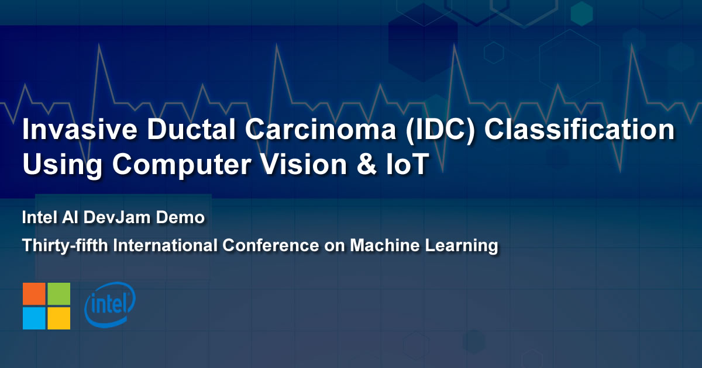
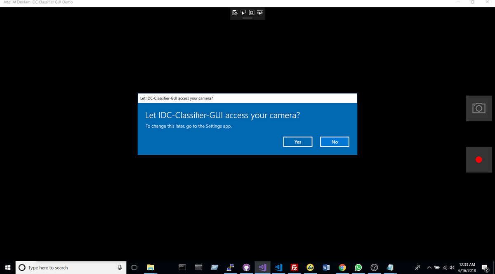
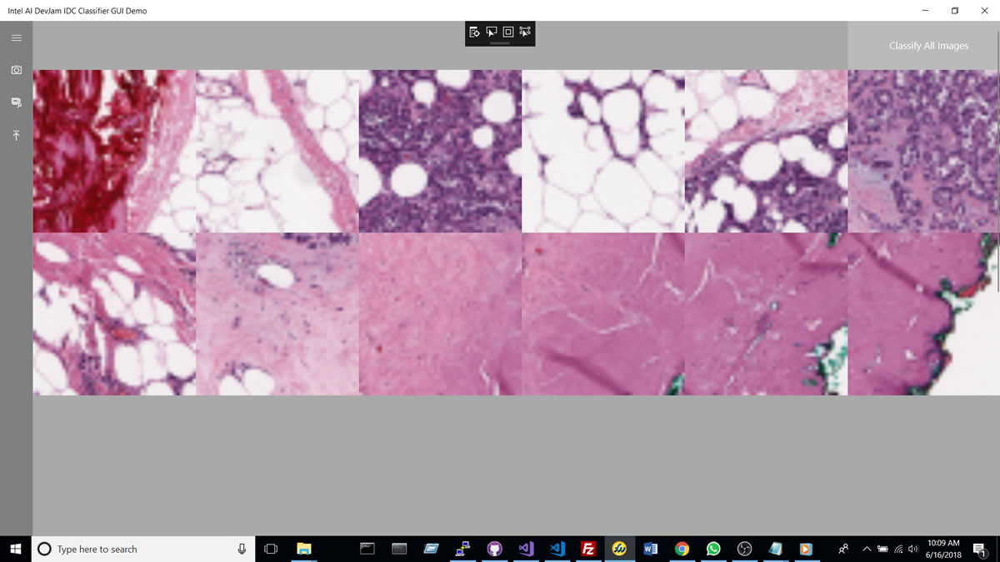
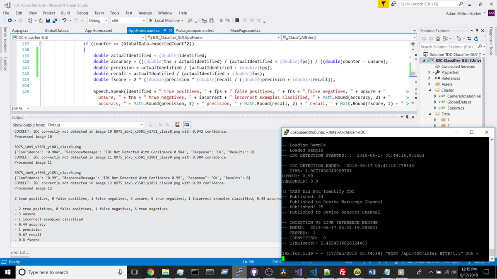
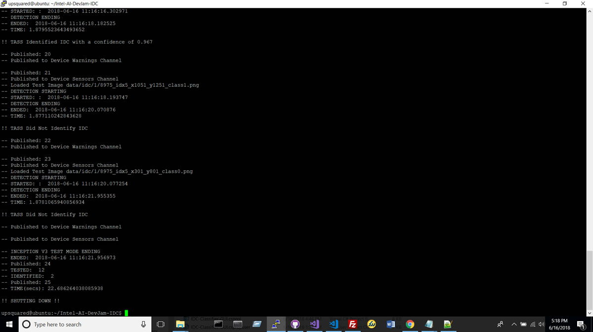
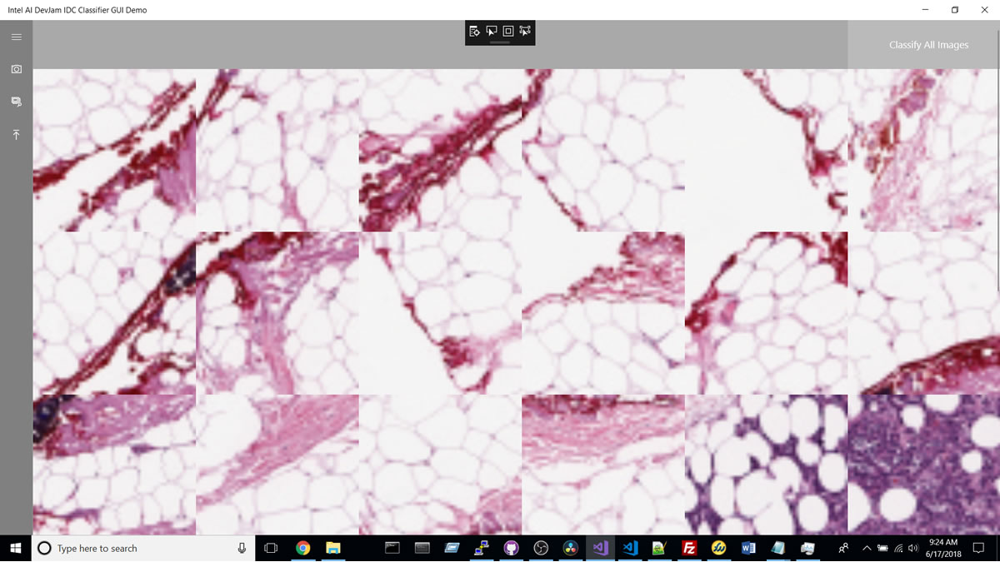
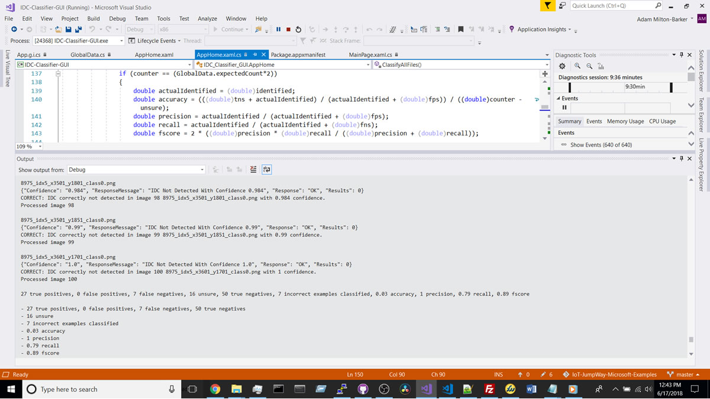

# Invasive Ductal Carcinoma (IDC) Classification Using Computer Vision & IoT
## Intel AI DevJam Demo GUI



## Abstract

The **Intel AI DevJam Demo** project provides the source codes and tutorials for setting up the project that will demonstrated at **Intel AI DevJam** at **ICML** (**International Conference on Machine Learning**) in **Sweden**, July 2018.

The **Intel® AI DevJam Demo GUI** uses a **Windows application** to communicate with a **facial recognition classifier** and a classifier trained to detect **Invasive Ductal Carcinoma (Breast cancer)** in **histology images**.

The goal of this project is to intentionally try to trick the model by using very similar, but opposite class, images from a small set of testing data that I believe humans may have difficulty telling apart. A larger set of testing data is also provided to compare how the model works on larger datasets. 

## IoT Connectivity

**IoT connectivity** for the project is provided by the [IoT JumpWay](https://www.iotjumpway.tech "IoT JumpWay"). The **IoT JumpWay** is an **IoT communication** platform as a service (PaaS) with a social network frontend. IoT JumpWay developers will soon be able to share projects/photos/videos and events. Use of the IoT JumpWay is completely free, you can find out more on the [Developer Program](https://iot.techbubbletechnologies.com/developers/ "Developer Program") page.

## Checklist

Make sure you have completed the following steps before continuing to configure the Universal Windows Application as you will need them to be waiting for queries or commands before you can complete this tutorial. 

- Setup the [IDC classification server/API](https://github.com/iotJumpway/IoT-JumpWay-Microsoft-Examples/tree/master/Intel-AI-DevJam-IDC/IDC-Classifier "IDC classification server/API").

- Setup the [IoT alarm device](https://github.com/iotJumpway/IoT-JumpWay-Microsoft-Examples/tree/master/Intel-AI-DevJam-IDC/Dev-Kit-IoT-Alarm "IoT alarm device").

## Software Requirements

- [Microsoft Visual Studio 2017](https://www.visualstudio.com/downloads/ "Microsoft Visual Studio 2017")

## Setting Up The Universal Windows Application


You should have already downloaded the repository source code when you completed the [IDC classification server/API](https://github.com/iotJumpway/IoT-JumpWay-Microsoft-Examples/tree/master/Intel-AI-DevJam-IDC/IDC-Classifier "IDC classification server/API") setup. Navigate to **IoT-JumpWay-Microsoft-Examples/Intel-AI-DevJam-IDC** and double click the **IDC-Classifier-GUI.sln** file to open the solution in **Visual Studio 2017**.

You need the application to connect to the server you setup while following the **IDC Classifier** tutorial. Inside the [IDC classification GUI Classes folder](https://github.com/iotJumpway/IoT-JumpWay-Microsoft-Examples/tree/master/Intel-AI-DevJam-IDC/IDC-Classifier-GUI/Classes "IDC classification GUI Classes folder") you will find a file called [GlobalData.cs](https://github.com/iotJumpway/IoT-JumpWay-Microsoft-Examples/tree/master/Intel-AI-DevJam-IDC/IDC-Classifier-GUI/Classes "GlobalData.cs"), in here you will find settings that you can use to connect to your IDC Classifier Server. When you start your IDC Classifier Server, the output will show you the IP/FQD and port number.

```
class GlobalData
{
    public string protocol = "http://";
    public string ip = "YOUR SERVER IP";
    public int port = 8080;
    public string endpoint = "/api/TASS/infer";
    public string endpointIDC = "/api/IDC/infer";
    public string dataFolder = "Data\\1";
    //public string dataFolder = "Data\\2";

    public double threshold = 0.80;
    public int expectedCount = 6;
}
```

## Testing Data

Inside the GUI project folder you will find a folder called **Data** and inside there 2 folders of data **1** & **2**. Currently the 1st folder has 12 specifically chosen **unseen histology images**. The images chosen were examples that I believed to be very similar to examples in the opposite class. The purpose of chosing these images was to see how the network reacts with very similar but opposite class images. You can flip between the two different size datasets, 1 & 2, or point to your own in the **dataFolder** setting in **Classes/GlobalData.cs**

To add your own data you can remove the images in the **Data** folder and add your own dataset to the folder. Once you have added them to the folder you need to remove any unused images from the directory inside of Visual Studio and then add the new images into the project by right clicking on the **Data** folder, clicking add, and then selecting your new dataset. 

## Testing The Universal Windows Application



For this to work it is neccessary for you to have added your photo to the [Known Data](https://github.com/iotJumpway/IoT-JumpWay-Microsoft-Examples/tree/master/Intel-AI-DevJam-IDC/IDC-Classifier/data/known "Known Data") folder of the [IDC Classifier](https://github.com/iotJumpway/IoT-JumpWay-Microsoft-Examples/tree/master/Intel-AI-DevJam-IDC/IDC-Classifier "IDC Classifier") folder. 

Run the app and as the app starts up it will ask you for camera and microphone permissions (microphone is currently unused at this stage in development). Once you accept the permissions the camera should start up and display on the screen. 


There is a known bug related to this part of the application which uses code from the [Windows Universal Samples: Basic camera app sample](https://github.com/Microsoft/Windows-universal-samples/tree/master/Samples/CameraStarterKit "Windows Universal Samples: Basic camera app sample"). You may need to restart the application a number of times before your camera loads. 

Click on the camera button on the right hand side to authenticate yourself. The application will take a photo of you and send it to the server for classification. You should now be authenticated onto the system, to add other people that have permissions to use the use the system simply add their photo to the known data folder in the IDC Classifier.



Click on the **Classify All Images** button to begin the classification process. The application will loop through the data and send it to the server for the classification. As each image is processed the application will notify you using voice, once the application finishes it will notify you of positive identifications, 

## Inception V3 Results

These results are from using the [AI DevJam Inception V3 IDC Classifier](https://github.com/iotJumpway/IoT-JumpWay-Microsoft-Examples/tree/master/Intel-AI-DevJam-IDC/IDC-Classifier/Inception "AI DevJam Inception V3 IDC Classifier"). As mentioned the images were purposely chosen to challenge the model on false negatives and positives. Ideally there would be 0 of either, but the best case scenario with misclassification is false positives, as it would be better to incorrectly predict non cancerous as cancercerous than it would be to predict cancerous as non cancerous.

The application has been set up to detect if a test classification is correct by checking for a string in file name to compare against the prediction. In this applications case, it will check negative predictions to see if the string **class0** exists in the file name, and for positive predictions it will check for **class1**, this felps to determine whether they are false negatives or false positives.



The logs can be viewed in the outputs area of Visual Studio. Here it will display the info of each image processed, the prediction and whether it is false positive/false negative or correct/incorrect, or whether the classifier is unsure due to a low confidence. What I hoped not see, but expected to see, was false negatives as I had chosen a testing dataset that I believed would possibly trick the classification model. 

The console logs and info from my testing below shows that the IDC Classifier identified 1 of the positive examples as negative, and the application caught 3 false positives as unsure and requires more incpection due to low confidences. 

```
8975_idx5_x301_y801_class0.png
{"Confidence": "1.0", "ResponseMessage": "IDC Not Detected With Confidence 1.0", "Response": "OK", "Results": 0}
CORRECT: IDC correctly not detected in image 1 8975_idx5_x301_y801_class0.png with 1 confidence.
Processed image 1
 
8975_idx5_x1001_y1451_class1.png
{"Confidence": "0.9526", "ResponseMessage": "IDC Not Detected With Confidence 0.9526", "Response": "OK", "Results": 0}
FALSE NEGATIVE: IDC incorrectly not detected in image 4 8975_idx5_x1001_y1451_class1.png with 0.9526 confidence.
Processed image 4
 
8975_idx5_x1051_y1251_class1.png
{"Confidence": "0.807", "ResponseMessage": "IDC Not Detected With Confidence 0.807", "Response": "OK", "Results": 0}
UNSURE: IDC detected in image 5 8975_idx5_x1051_y1251_class1.png with 0.807 confidence.
Processed image 5

------------------------------------------------

8975_idx5_x3501_y1801_class0.png
{"Confidence": "0.984", "ResponseMessage": "IDC Not Detected With Confidence 0.984", "Response": "OK", "Results": 0}
CORRECT: IDC correctly not detected in image 11 8975_idx5_x3501_y1801_class0.png with 0.984 confidence.
Processed image 11
 
8975_idx5_x3501_y1851_class0.png
{"Confidence": "0.99", "ResponseMessage": "IDC Not Detected With Confidence 0.99", "Response": "OK", "Results": 0}
CORRECT: IDC correctly not detected in image 12 8975_idx5_x3501_y1851_class0.png with 0.99 confidence.
Processed image 12
 
2 true positives, 0 false positives, 1 false negatives, 3 unsure, 6 true negatives, 1 incorrect examples classified, 0.44 accuracy, 1 precision, 0.67 recall, 0.8 fscore
 
- 2 true positives, 0 false positives, 1 false negatives, 6 true negatives
- 3 unsure
- 1 incorrect examples classified
- 0.44 accuracy
- 1 precision
- 0.67 recall
- 0.8 fscore
```

The application will classify the image as unsure if it is a positive or negative classification but has a confidence lower than the **threshold** set in **Classes/GlobalData.cs**.  

## False Negatives

```
8975_idx5_x1001_y1451_class1.png
{"Confidence": "0.9526", "ResponseMessage": "IDC Not Detected With Confidence 0.9526", "Response": "OK", "Results": 0}
FALSE NEGATIVE: IDC incorrectly not detected in image 4 8975_idx5_x1001_y1451_class1.png with 0.9526 confidence.
Processed image 4
```

## Unsure

By detecting whether the classifier is **unsure** or not, we can remove some data that can be further investigated. In this example, if it is a **negative** or **positive** classification, but the confidence is lower than the threshold, it will remove them from calculations and the **unsure** classifications are identified for further investigation. This allowed the application to catch three of the **false negatives** and mark them as **unsure**. 

In a real world example the use of a threshold would make the application more safe. By catching three of the false negatives, we have helped the classifier to separate the **unsure** data.  

The application is able to understand that it is not very confident on some of the images it classified. This is good because the incorrectly classified images were **false negatives**, this means that if we had not caught these, three of the classifications would of shown no cancer when there actually was cancer. 

The application allows a doctor for example, to manually check images that the classifier has classified but is unsure about. 

Below are the **unsure** classifications made by the application using the **Data\\1** **dataFolder** setting in **Classes/GlobalData.cs**:
 
```
8975_idx5_x1051_y1251_class1.png
{"Confidence": "0.807", "ResponseMessage": "IDC Not Detected With Confidence 0.807", "Response": "OK", "Results": 0}
UNSURE: IDC detected in image 5 8975_idx5_x1051_y1251_class1.png with 0.807 confidence.
Processed image 5

8975_idx5_x1251_y1251_class1.png
{"Confidence": "0.851", "ResponseMessage": "IDC Not Detected With Confidence 0.851", "Response": "OK", "Results": 0}
UNSURE: IDC detected in image 7 8975_idx5_x1251_y1251_class1.png with 0.851 confidence.
Processed image 7
 
8975_idx5_x1251_y1901_class1.png
{"Confidence": "0.726", "ResponseMessage": "IDC Not Detected With Confidence 0.726", "Response": "OK", "Results": 0}
UNSURE: IDC detected in image 8 8975_idx5_x1251_y1901_class1.png with 0.726 confidence.
Processed image 8
```


You can see the images that were incorrectly classified along with images from opposing classes that I believed may be able to trick the IDC Classifer in the image above. I was able to find similar looking images from the negative class that shows the classifier may of confused two similar images from two seperate classes.



This was also tested using the [IDC Classifier Test Program](https://github.com/iotJumpway/IoT-JumpWay-Microsoft-Examples/blob/master/Intel-AI-DevJam-IDC/IDC-Classifier/Classifier.py "IDC Classifier Test Program") with the same outcome. It seems that similar to facial recognition, Inception V3 gets confused on similar images, this can be confirmed or not by testing larger datasets.


## Things To Try

- Test on a larger dataset
- Train more similar examples of the misidentified images
- Increase the size of the images from the dataset to 200px x 200px
- Use a different model

## Testing On A Larger DataSet

The second folder located in the **Data** folder can be used to test the classifier on 100 images, 50 negative and 50 positive. These images have been randomly selected and may or may not confuse similar images from seperate classes.

 

## Data Folder

You need the application to use the larger IDC testing data folder. You can achieve this by editing the **Classes/GlobalData.cs** file and uncommenting the **Data\\2** folder and commenting out the **Data\\1** folder. Then change **expectedCount** to 50.

```
class GlobalData
{
    public string protocol = "http://";
    public string ip = "YOUR SERVER IP";
    public int port = 8080;
    public string endpoint = "/api/TASS/infer";
    public string endpointIDC = "/api/IDC/infer";
    //public string dataFolder = "Data\\1";
    public string dataFolder = "Data\\2";

    public double threshold = 0.80;
    public int expectedCount = 50;
}
```

This will start the application using the larger dataset the next time you run the application. The process is the same as when we tested the smaller dataset. Click on the **Classify All Images** button and the program will start to process the images.

## Inception V3 Results

Below you can see the end of the console output from testing using folder **Data\\2** with 50 IDC positive and 50 IDC negative images.

 

```
8975_idx5_x3501_y1801_class0.png
{"Confidence": "0.984", "ResponseMessage": "IDC Not Detected With Confidence 0.984", "Response": "OK", "Results": 0}
CORRECT: IDC correctly not detected in image 98 8975_idx5_x3501_y1801_class0.png with 0.984 confidence.
Processed image 98
 
8975_idx5_x3501_y1851_class0.png
{"Confidence": "0.99", "ResponseMessage": "IDC Not Detected With Confidence 0.99", "Response": "OK", "Results": 0}
CORRECT: IDC correctly not detected in image 99 8975_idx5_x3501_y1851_class0.png with 0.99 confidence.
Processed image 99
 
8975_idx5_x3601_y1701_class0.png
{"Confidence": "1.0", "ResponseMessage": "IDC Not Detected With Confidence 1.0", "Response": "OK", "Results": 0}
CORRECT: IDC correctly not detected in image 100 8975_idx5_x3601_y1701_class0.png with 1 confidence.
Processed image 100
 
27 true positives, 0 false positives, 7 false negatives, 16 unsure, 50 true negatives, 7 incorrect examples classified, 0.03 accuracy, 1 precision, 0.79 recall, 0.89 fscore
 
- 27 true positives, 0 false positives, 7 false negatives, 50 true negatives
- 16 unsure
- 7 incorrect examples classified
- 0.03 accuracy
- 1 precision
- 0.79 recall
- 0.89 fscore
```

The above shows that on a dataset of 100 images there were 7 incorrect classifications all of which are **false negatives** with a **confidence of 0.90 or higher**. The application marked 16 images as **unsure** and **correctly** identified 27 of the 50 IDC positive images.

## False Negatives

```
8975_idx5_x1001_y1451_class1.png
{"Confidence": "0.9526", "ResponseMessage": "IDC Not Detected With Confidence 0.9526", "Response": "OK", "Results": 0}
FALSE NEGATIVE: IDC incorrectly not detected in image 20 8975_idx5_x1001_y1451_class1.png with 0.9526 confidence.
Processed image 20

8975_idx5_x1051_y1451_class1.png
{"Confidence": "0.904", "ResponseMessage": "IDC Not Detected With Confidence 0.904", "Response": "OK", "Results": 0}
FALSE NEGATIVE: IDC incorrectly not detected in image 25 8975_idx5_x1051_y1451_class1.png with 0.904 confidence.
Processed image 25
 
8975_idx5_x1051_y1601_class1.png
{"Confidence": "0.937", "ResponseMessage": "IDC Not Detected With Confidence 0.937", "Response": "OK", "Results": 0}
FALSE NEGATIVE: IDC incorrectly not detected in image 26 8975_idx5_x1051_y1601_class1.png with 0.937 confidence.
Processed image 26
 
8975_idx5_x1051_y1651_class1.png
{"Confidence": "0.9727", "ResponseMessage": "IDC Not Detected With Confidence 0.9727", "Response": "OK", "Results": 0}
FALSE NEGATIVE: IDC incorrectly not detected in image 27 8975_idx5_x1051_y1651_class1.png with 0.9727 confidence.
Processed image 27

8975_idx5_x1151_y1201_class1.png
{"Confidence": "0.973", "ResponseMessage": "IDC Not Detected With Confidence 0.973", "Response": "OK", "Results": 0}
FALSE NEGATIVE: IDC incorrectly not detected in image 38 8975_idx5_x1151_y1201_class1.png with 0.973 confidence.
Processed image 38
 
8975_idx5_x1201_y1201_class1.png
{"Confidence": "0.958", "ResponseMessage": "IDC Not Detected With Confidence 0.958", "Response": "OK", "Results": 0}
FALSE NEGATIVE: IDC incorrectly not detected in image 51 8975_idx5_x1201_y1201_class1.png with 0.958 confidence.
Processed image 51

8975_idx5_x1251_y1201_class1.png
{"Confidence": "0.979", "ResponseMessage": "IDC Not Detected With Confidence 0.979", "Response": "OK", "Results": 0}
FALSE NEGATIVE: IDC incorrectly not detected in image 65 8975_idx5_x1251_y1201_class1.png with 0.979 confidence.
Processed image 65

```

## Unsure

``` 
8975_idx5_x1001_y1301_class1.png
{"Confidence": "0.8223", "ResponseMessage": "IDC Detected With Confidence 0.8223", "Response": "OK", "Results": 1}
UNSURE: IDC detected in image 17 8975_idx5_x1001_y1301_class1.png with 0.8223 confidence.
Processed image 17

8975_idx5_x1051_y1251_class1.png
{"Confidence": "0.807", "ResponseMessage": "IDC Not Detected With Confidence 0.807", "Response": "OK", "Results": 0}
UNSURE: IDC not detected in image 21 8975_idx5_x1051_y1251_class1.png with 0.807 confidence.
Processed image 21
 
8975_idx5_x1051_y1301_class1.png
{"Confidence": "0.723", "ResponseMessage": "IDC Not Detected With Confidence 0.723", "Response": "OK", "Results": 0}
UNSURE: IDC not detected in image 22 8975_idx5_x1051_y1301_class1.png with 0.723 confidence.
Processed image 22

8975_idx5_x1051_y1401_class1.png
{"Confidence": "0.854", "ResponseMessage": "IDC Detected With Confidence 0.854", "Response": "OK", "Results": 1}
UNSURE: IDC detected in image 24 8975_idx5_x1051_y1401_class1.png with 0.854 confidence.
Processed image 24
 
8975_idx5_x1101_y1251_class1.png
{"Confidence": "0.8604", "ResponseMessage": "IDC Detected With Confidence 0.8604", "Response": "OK", "Results": 1}
UNSURE: IDC detected in image 28 8975_idx5_x1101_y1251_class1.png with 0.8604 confidence.
Processed image 28

8975_idx5_x1101_y1451_class1.png
{"Confidence": "0.622", "ResponseMessage": "IDC Not Detected With Confidence 0.622", "Response": "OK", "Results": 0}
UNSURE: IDC not detected in image 32 8975_idx5_x1101_y1451_class1.png with 0.622 confidence.
Processed image 32
 
8975_idx5_x1101_y1501_class1.png
{"Confidence": "0.887", "ResponseMessage": "IDC Not Detected With Confidence 0.887", "Response": "OK", "Results": 0}
UNSURE: IDC detected in image 33 8975_idx5_x1101_y1501_class1.png with 0.887 confidence.
Processed image 33
 
8975_idx5_x1101_y1551_class1.png
{"Confidence": "0.84", "ResponseMessage": "IDC Detected With Confidence 0.84", "Response": "OK", "Results": 1}
UNSURE: IDC detected in image 34 8975_idx5_x1101_y1551_class1.png with 0.84 confidence.
Processed image 34

8975_idx5_x1101_y1701_class1.png
{"Confidence": "0.8193", "ResponseMessage": "IDC Detected With Confidence 0.8193", "Response": "OK", "Results": 1}
UNSURE: IDC detected in image 37 8975_idx5_x1101_y1701_class1.png with 0.8193 confidence.
Processed image 37
 
8975_idx5_x1151_y1251_class1.png
{"Confidence": "0.5435", "ResponseMessage": "IDC Not Detected With Confidence 0.5435", "Response": "OK", "Results": 0}
UNSURE: IDC not detected in image 39 8975_idx5_x1151_y1251_class1.png with 0.5435 confidence.
Processed image 39

8975_idx5_x1151_y1451_class1.png
{"Confidence": "0.891", "ResponseMessage": "IDC Detected With Confidence 0.891", "Response": "OK", "Results": 1}
UNSURE: IDC detected in image 43 8975_idx5_x1151_y1451_class1.png with 0.891 confidence.
Processed image 43

8975_idx5_x1151_y1601_class1.png
{"Confidence": "0.849", "ResponseMessage": "IDC Detected With Confidence 0.849", "Response": "OK", "Results": 1}
UNSURE: IDC detected in image 46 8975_idx5_x1151_y1601_class1.png with 0.849 confidence.
Processed image 46

8975_idx5_x1151_y1801_class1.png
{"Confidence": "0.7793", "ResponseMessage": "IDC Not Detected With Confidence 0.7793", "Response": "OK", "Results": 0}
UNSURE: IDC not detected in image 50 8975_idx5_x1151_y1801_class1.png with 0.7793 confidence.
Processed image 50
 
8975_idx5_x1201_y1251_class1.png
{"Confidence": "0.8906", "ResponseMessage": "IDC Not Detected With Confidence 0.8906", "Response": "OK", "Results": 0}
UNSURE: IDC not detected in image 52 8975_idx5_x1201_y1251_class1.png with 0.8906 confidence.
Processed image 52

8975_idx5_x1201_y1851_class1.png
{"Confidence": "0.895", "ResponseMessage": "IDC Detected With Confidence 0.895", "Response": "OK", "Results": 1}
UNSURE: IDC detected in image 64 8975_idx5_x1201_y1851_class1.png with 0.895 confidence.
Processed image 64
 
8975_idx5_x1251_y1251_class1.png
{"Confidence": "0.851", "ResponseMessage": "IDC Not Detected With Confidence 0.851", "Response": "OK", "Results": 0}
UNSURE: IDC not detected in image 66 8975_idx5_x1251_y1251_class1.png with 0.851 confidence.
Processed image 66

```

## Get Involved 
This project is open sourced under the MIT license. All contributions are welcome, you can choose from any of the features list below or submit your own features for review via a pull request. 

## Features List 
Below you will find any features that will be implemented. Pull requests are welcome.

- [IoTJumpWay Integration](https://www.iotjumpway.tech "IoTJumpWay Integration")

## Bugs/Issues

Please feel free to create issues for bugs and general issues you come across whilst using this or any other IoT JumpWay Microsoft repo issues: [IoT-JumpWay-Microsoft-Examples Github Issues](https://github.com/iotJumpway/IoT-JumpWay-Microsoft-Examples/issues "IoT-JumpWay-Microsoft-Examples Github Issues")

## Known Bugs
Below you will find all known bugs in the application. Each bug has a corresponding issue in the repo issues area. Pull requests are welcome.

- [KNOWN BUG: Crashes after permissions](https://github.com/iotJumpway/IoT-JumpWay-Microsoft-Examples/issues/1 "KNOWN BUG: Crashes after permissions")

## Contributors

[](https://github.com/AdamMiltonBarker)

